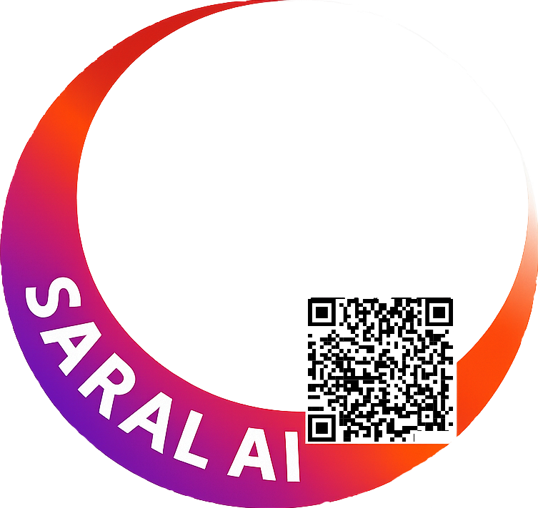

# SARAL AI Badge Generator

Add the SARAL AI badge to your profile photo and join the open-source AI movement! 🚀



## 🤝 Contribute

We welcome contributions! Here are two features we'd love help building:

### 1. Image Position Adjustment for Non-Square Photos
When a user uploads an image that isn't 1:1 (square), allow them to **pan/scroll the image** within the badge frame to position it perfectly:
- **Portrait photo** (height > width): User can scroll vertically to choose which part appears in the badge
- **Landscape photo** (width > height): User can scroll horizontally to center their face

This gives users control instead of auto-cropping to center.

### 2. Zoom/Scale Control
Allow users to **zoom in or zoom out** of their uploaded photo before applying the badge:
- Useful when the face is too small in the original photo
- Lets users crop tighter or show more background
- Combined with position adjustment, gives complete control over framing

Could be implemented as a simple slider or ± buttons.

---

## Features

- 📤 **Upload Photo** - Drag & drop or click to upload your profile photo
- ️ **Side-by-Side Comparison** - See original and badged photos together
- ⬇️ **Easy Download** - One-click download of your new profile photo
- 🎨 **Modern Design** - Beautiful glassmorphism UI with smooth animations
- 📱 **Responsive** - Works on desktop and mobile

## Local Steup of the project

Simply open `index.html` in your browser, or use a local server:

```bash
# Using npx (no installation needed)
npx serve .

# Or using Python
python -m http.server 8080
```

Then visit `http://localhost:8080`

## Usage

1. Click the upload zone or drag & drop your photo
2. View the side-by-side comparison (original vs badged)
3. Click "Download Image" to save your new profile photo


## Updating the Badge

To use a different badge:

1. Replace `assets/saral-badge.png` with your new badge
2. Ensure the new badge is:
   - PNG format with transparent background
   - 1:1 aspect ratio (square)
   - The circular frame design that wraps around the profile photo

No code changes needed! 🎉

## Project Structure

```
saral-ai-badge-generator/
├── index.html          # Main webpage
├── styles.css          # Styling
├── app.js              # Frontend logic
├── assets/
│   └── saral-badge.png # Badge image (replaceable)
└── README.md           # This file
```

## Tech Stack

| Component | Technology |
|-----------|------------|
| Frontend | HTML5, CSS3, Vanilla JavaScript |
| Image Processing | HTML5 Canvas API |
| Deployment | Static hosting (Vercel) |


## License

MIT License - Free to use and modify

---

Made with ❤️ for the **SARAL AI** community
